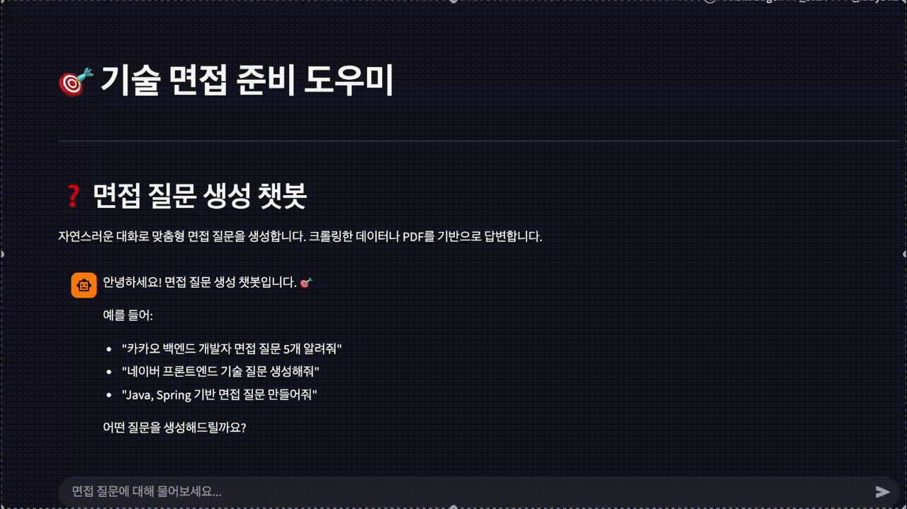

# 🎯 Interview Coach AI

면접 준비를 위한 AI 기반 챗봇 서비스입니다. AWS Bedrock의 Claude 모델과 RAG(Retrieval Augmented Generation) 기술을 활용하여 맞춤형 면접 질문을 생성하고 답변을 제공합니다.

## 📋 프로젝트 개요

**Interview Coach AI**는 기술 면접 준비를 돕는 AI 서비스입니다. 사용자가 업로드한 이력서/자기소개서 PDF와 크롤링한 회사별 기술 스택 문서를 기반으로 맞춤형 면접 질문을 생성하고, STAR 기법을 활용한 피드백을 제공합니다.

## 🎥 데모 영상




### 주요 기능

- 🤖 **AI 기반 면접 질문 생성**: Claude 3.5 Sonnet을 활용한 맞춤형 질문 생성
- 📄 **PDF 문서 분석**: 이력서/자기소개서 PDF 업로드 및 텍스트 추출
- 🕷️ **웹 크롤링**: 회사별 기술 스택 문서 자동 크롤링
- 🔍 **RAG 기반 검색**: 벡터 DB를 활용한 관련 문서 검색 및 컨텍스트 제공
- 💬 **Multi-turn 대화**: 이전 대화 내용을 기억하는 자연스러운 대화
- ⚡ **스트리밍 응답**: 실시간으로 생성되는 응답 스트리밍
- 📊 **면접 히스토리 관리**: 면접 질문 및 답변 히스토리 저장

## 👤 팀원 소개

**1인 프로젝트**

- 개발자: 프로젝트 전체 기획, 설계, 개발, 배포 담당

## 🏗️ 프로젝트 아키텍처

```
┌─────────────────────────────────────────────────────────────┐
│                      Streamlit Frontend                      │
│  (홈, Bedrock 연결 테스트, PDF 업로드, 크롤링, 질문 생성)    │
└───────────────────────┬─────────────────────────────────────┘
                        │
                        ▼
┌─────────────────────────────────────────────────────────────┐
│                    Application Layer                        │
│  ┌──────────────┐  ┌──────────────┐  ┌──────────────┐      │
│  │ PDF Service  │  │Crawler Service│ │ RAG Service  │      │
│  └──────────────┘  └──────────────┘  └──────────────┘      │
│                                                              │
│  ┌──────────────┐  ┌──────────────┐  ┌──────────────┐      │
│  │Bedrock Service│ │Rate Limiter   │  │Config Service │      │
│  └──────────────┘  └──────────────┘  └──────────────┘      │
└───────────────────────┬─────────────────────────────────────┘
                        │
        ┌───────────────┴───────────────┐
        │                               │
        ▼                               ▼
┌──────────────────┐          ┌──────────────────┐
│   AWS Bedrock    │          │    ChromaDB       │
│                  │          │   (Vector DB)    │
│  - Claude 3.5    │          │                  │
│  - Titan Embed   │          │  - Document Store│
│                  │          │  - Embeddings    │
└──────────────────┘          └──────────────────┘
```

### 기술 스택

- **Frontend**: Streamlit
- **Backend**: Python 3.13
- **LLM**: AWS Bedrock (Claude 3.5 Sonnet)
- **Embeddings**: AWS Bedrock (Titan Embed Text v2)
- **Vector DB**: ChromaDB
- **Web Crawling**: Selenium, BeautifulSoup
- **PDF Processing**: pdfplumber
- **Framework**: LangChain

## 🚀 애플리케이션 실행 방법

### 1. 사전 요구사항

- Python 3.13 이상
- AWS 계정 및 Bedrock 접근 권한
- Chrome 브라우저 (웹 크롤링용)

### 2. 환경 설정

```bash
# 저장소 클론
git clone <repository-url>
cd interview-coach

# 가상환경 생성 및 활성화
cd backend
python3 -m venv venv
source venv/bin/activate  # Windows: venv\Scripts\activate

# 의존성 설치
pip install -r requirements.txt
```

### 3. 환경 변수 설정

`.env` 파일을 생성하고 다음 정보를 입력하세요:

```env
# AWS 설정
AWS_REGION=us-east-1
AWS_ACCESS_KEY_ID=your_access_key
AWS_SECRET_ACCESS_KEY=your_secret_key

# Bedrock 모델 설정
BEDROCK_MODEL_ID=anthropic.claude-3-5-sonnet-20240620-v1:0
EMBEDDING_MODEL=amazon.titan-embed-text-v2:0

# 데이터베이스 설정
DATABASE_URL=sqlite:///./interview_coach.db
CHROMA_PERSIST_DIRECTORY=./chroma_db
```

### 4. AWS Bedrock 모델 접근 권한 설정

1. AWS 콘솔에서 Bedrock 서비스로 이동
2. "Model access" 메뉴에서 Claude 모델 접근 요청
3. 승인 대기 (보통 몇 분 ~ 몇 시간 소요)

### 5. 애플리케이션 실행

```bash
# Streamlit 앱 실행
streamlit run app.py
```

브라우저에서 `http://localhost:8501`로 접속하세요.

## 🔧 주요 기능 사용 방법

### 1. Bedrock 연결 테스트
- 사이드바에서 "🔗 Bedrock 연결 테스트" 페이지 선택
- "🔍 연결 테스트" 버튼 클릭하여 연결 확인

### 2. PDF 업로드
- "📄 PDF 업로드" 페이지에서 이력서/자기소개서 PDF 업로드
- 자동으로 텍스트 추출 및 RAG에 추가

### 3. 웹 크롤링
- "🕷️ 웹 크롤링" 페이지에서 URL 입력
- 지원 회사 기술 스택 문서 크롤링
- 자동으로 RAG에 추가

### 4. 면접 질문 생성
- "❓ 질문 생성" 페이지에서 자연스러운 대화로 질문 요청
- 예: "카카오 백엔드 개발자 면접 질문 5개 만들어줘"
- RAG 기반으로 관련 문서를 참고하여 맞춤형 질문 생성

## 🛠️ 기술적 도전 과제와 해결 과정

### 1. ThrottlingException 해결

**문제**: AWS Bedrock의 요청 한도 초과로 인한 ThrottlingException 발생

**해결 방법**:
- Rate Limiter 구현: 요청 간 최소 4초 간격 유지
- Exponential Backoff 재시도 로직 구현 (최대 5회 재시도)
- 토큰 사용량 최적화: 메시지 히스토리 길이 제한, 컨텍스트 크기 조정

```python
# Rate Limiter 구현
rate_limiter = RateLimiter(min_interval=4.0)

# Exponential Backoff
for attempt in range(max_retries):
    try:
        await rate_limiter.wait_if_needed()
        response = await self.llm.ainvoke(message)
        return response
    except ThrottlingException:
        delay = base_delay * (2 ** attempt)
        await asyncio.sleep(delay)
```

### 2. Multi-turn 대화 구현

**문제**: 이전 대화 내용을 기억하지 못하는 문제

**해결 방법**:
- Streamlit session_state를 활용한 대화 히스토리 관리
- 최근 4개 메시지만 LLM에 전달하여 토큰 절약
- 초기 환영 메시지와 현재 질문을 히스토리에서 제외하는 로직 구현

```python
# 대화 히스토리 관리
recent_messages = st.session_state.question_messages[-4:]
# 초기 환영 메시지 제외
actual_conversation = all_messages[1:] if len(all_messages) > 1 else []
```

### 3. 동적 웹사이트 크롤링

**문제**: JavaScript로 렌더링되는 동적 콘텐츠 크롤링 실패

**해결 방법**:
- Selenium을 활용한 브라우저 자동화
- GitHub, 네이버 블로그, 티스토리 등 플랫폼별 전용 크롤링 메서드 구현
- 페이지 로드 대기 및 스크롤 처리로 동적 콘텐츠 로딩

```python
# Selenium을 사용한 동적 크롤링
driver = webdriver.Chrome(options=chrome_options)
driver.get(url)
WebDriverWait(driver, 15).until(EC.presence_of_element_located((By.TAG_NAME, "body")))
time.sleep(5)  # JavaScript 실행 대기
```

### 4. RAG 검색 범위 최적화

**문제**: 검색된 문서가 너무 적어 컨텍스트 부족

**해결 방법**:
- 검색 문서 수 증가: 2개 → 10개
- 각 문서의 컨텍스트 길이 증가: 300자 → 500자
- ChromaDB retriever 파라미터 최적화

```python
# 검색 범위 확대
relevant_docs = await rag_service.search_documents(query, k=10)
context = "\n\n".join([doc.page_content[:500] for doc in relevant_docs])
```

## 📊 팀원별 역할 및 기여도

### 개발자 (100%)

- **프로젝트 기획 및 설계**: 전체 시스템 아키텍처 설계
- **Frontend 개발**: Streamlit 기반 UI/UX 구현
- **Backend 개발**: 
  - RAG 서비스 구현
  - Bedrock 통합
  - 크롤링 서비스 개발
  - PDF 처리 서비스 개발
- **인프라 설정**: AWS Bedrock 설정 및 모델 접근 권한 관리
- **문제 해결**: Throttling, Multi-turn, 크롤링 등 기술적 도전 과제 해결
- **문서화**: README 작성 및 코드 주석

## 📁 프로젝트 구조

```
interview-coach/
├── backend/
│   ├── app.py                 # Streamlit 메인 애플리케이션
│   ├── app/
│   │   ├── config.py          # 설정 관리
│   │   └── services/
│   │       ├── bedrock_service.py    # AWS Bedrock 서비스
│   │       ├── rag_service.py        # RAG 서비스
│   │       ├── crawler_service.py   # 웹 크롤링 서비스
│   │       ├── pdf_service.py        # PDF 처리 서비스
│   │       └── rate_limiter.py       # Rate Limiting
│   ├── requirements.txt       # Python 의존성
│   ├── chroma_db/            # ChromaDB 벡터 DB (데이터)
│   └── interview_coach.db    # SQLite 데이터베이스
├── .gitignore
└── README.md
```

## 🔐 보안 주의사항

- `.env` 파일은 절대 Git에 커밋하지 마세요
- AWS 자격 증명은 환경 변수로 관리하세요
- 프로덕션 환경에서는 IAM 역할을 사용하는 것을 권장합니다

## 📝 라이선스

이 프로젝트는 개인 프로젝트입니다.

## 🤝 기여

현재는 개인 프로젝트이지만, 제안이나 피드백은 언제든 환영합니다!

## 📧 문의

프로젝트에 대한 문의사항이 있으시면 이슈를 등록해주세요.

---
